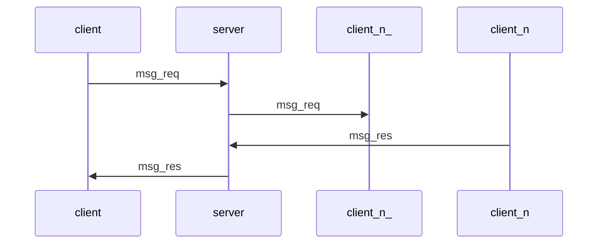
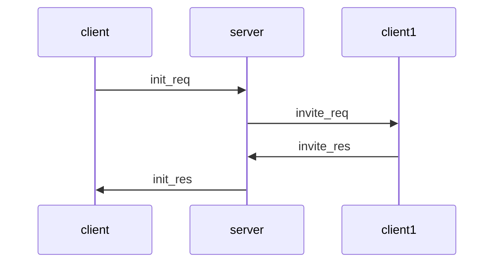
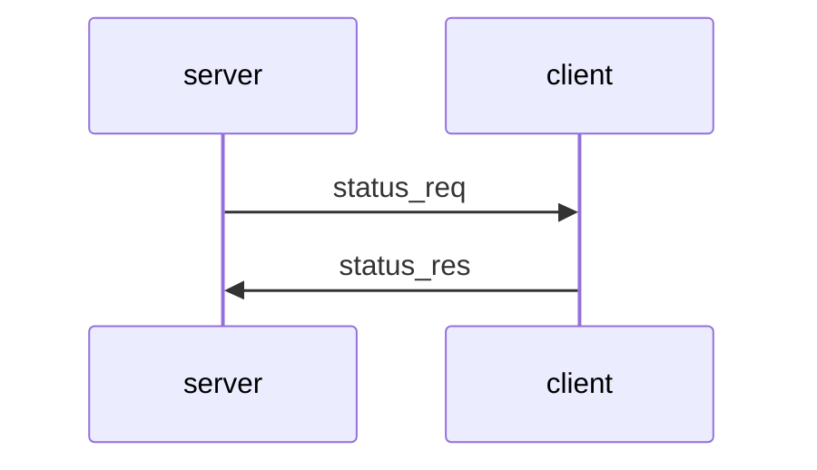
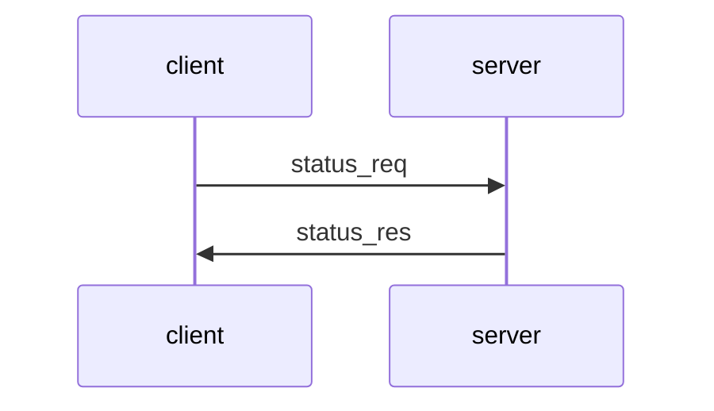

# Multy-Party Chat
This document specifies a multy-party chat protocol. It can be used by multiple clients to send messages each other through a server. The server shuldn't know the content of tge messages. The protocol supports the following commands:

- __init__ --> Init a new session with the participants. After the session created participants can't be added or removed.
- __close__ --> Close the session and delete all messages. Notifys the online participants.
- __accept__ --> A client can accept the invitation from other clients to a session.
- __decline__ --> A client can decline the invitation from other clients to a session.
- __msg__ --> Sends a message to other participants of the session.
  

The clients and the server communicate via a network and execute the above commands remotely. It assumes that the client and the server uses the TCP/IP protocol to establish a connection and to send data reliably to each other. By reliability, we mean that the bytes sent by a party arrive to the other party, and they arrive in the order that they were sent. The chat server must listen and accept client connection requests on TCP port 5150.

The server mustn't know the content of the messages. 

## Overview of sub-protocols
The chat protocol has the following sub-protocols: Message Transfer Protocol (MTP), Init Protocol, Close Protocol and Status Protocol. The following figure shows how these sub-protocols are related to each other: 

```
  +---------------------+   +----------------------+  +-----------------------+   
  |    Init Protocol    |   |    Close Protocol    |  |    Status Protocol    |
  +---------------------+   +----------------------+  +-----------------------+    
  +---------------------------------------------------------------------------+
  |                     Message Transfer Protocol (MTP)                       |
  +---------------------------------------------------------------------------+
```

Messages are carried by the Message Transfer Protocol (MTP), which provides cryptographic protection to them. Messages are encrypted, their integrity is protected. MTP uses symmetric key cryptographic primitives, which require secret keys shared between the client and the server. These keys are established by the Login Protocol.

The Init Protocol is used to creat a new session, each session has a unique session ID (sid). At init, the inicialisation cliant has to choose the partners, by public ID-s.
During inicialisation the server creats the session and sends invites to the other participants (when they are online). The clients can accept or deny the invitation. After the Session is created each clien can send text messages to the other clients by the Message Transfer Protocol. When the session is completed it can be closed by the Close protocol.

## Message Transfer Protocol 
The Message Transfer Protocol (MTP) uses cryptography to encrypt all messages, to protect their integrity, and to ensure their authenticity.


### Message formats
All MTP messages has the following format:

```
	+---+---+---+---+---+---+---+---+---+---+---+---+---+---+---+---+
	|  ver  |  typ  |  len  |  sqn  |             sid               |
	+---+---+---+---+---+---+---+---+---+---+---+---+---+---+---+---+
	|              uid              |                               |
	+---+---+---+---+---+---+---+---+                               +
	|                                                               |
	.                                                               .
	.                    encrypted payload (epd)                    .
	.                                                               .
	|                                                               |
	+                                                               +
	|                                                               |
	+               +---+---+---+---+---+---+---+---+---+---+---+---+
	|               |                      mac                      |
	+---+---+---+---+---+---+---+---+---+---+---+---+---+---+---+---+
```

Messages have a 24-byte header that consists of the following fields:

- __ver__: A 2-byte _version number_ field, where the first byte is the major version and the second byte is the minor version. 
- __typ__: A 2-byte _message type_ field that specifies the type of the payload in the message. The following message types are supported:
	- `00 00` : _init_req_ (init request)
	- `00 10` : _init_res_ (login response)
	- `01 00` : _close_req_ (close request)
	- `01 10` : _close_res_ (close response)
	- `02 00` : _msg_req_ (message request)
	- `02 10` : _msg_res_ (message response)
	- `03 00` : _invite_req_ (invitation request)
	- `03 10` : _invite_res_ (invitation response)
	- `04 00` : _status_req_ (status request)
	- `04 10` : _status_res_ (status response)
- __len__: A 2-byte _message length_ field that contains the length of the entire message (including the header) in bytes (using big endian byte order).
- __sqn__: A 2-byte _message sequence number_ field that contains the sequence number of this message (using big endian byte order).
- __sid__: A 8-byte _session id_ field that contains the unique ID of the session.
- __uid__: A 8-byte _user id_ field that contains the unique ID of the sender.

The header is followed by the AES-GCM enrcrypted payload (__epd__) and the AES-GCM authentication tag (__mac__). The mac field in this version of the protocol must be 12 bytes long.  

### Processing
If the type of the message is message request(`02 00`) or message response(`02 10`) then the server should not know the content. In other words the server is not the destination.

If the type is something other, then the content of the message is encripted by the public key of the server. That means the server executes the specific steps.

### Simple message to the other clients



_init_req_

When the init request is send the sid is unknow and it is given by the server. Is the valu is 0 in the header.

The format of the init request message (MTP type `02 00`) is the following:

```
<message_u1>'\n'
<message_u2>'\n'
.
.
.
<message_un>'\n'
```

where `'\n'` is the new line character. Thus, the `'\n'` character serves as a delimiter that separates the fields of the message. The fields are specified as follows:

- `<message_un>` the messega encripted with the nth user's public key.

_msg_res_

It's header contains the given suid.

The format of the init response message (MTP type `02 10`) is the following:

```
<response>
```

where 

- `<response>` is a UTF-8 text which is "OK", if the initialisation was successfull. If it wasn't, then the text is an error message.

The server has all the specific clients messages. It can send the individually encripted messages to the correct clients. But only the clients can decrypt theri messages. The server's inner implementation handles the status of the individual users. The impelmentation can use the Status Protocol.


## Init Protocol
The Init Protocol is responsible for the inicalisation of a new Session. The creator client sends the server the init request. 

### Message exchange
The message exchange of the Init Protocol is shown in the figure below:



The Login Protocol consists of 2 message transfers. First, the client must send a login request (login_req) to the server, and after that, the server must send a login response (login_res) to the client. If the server receives another type of message when it expects a login request, or the client receives another type of message when it expects a login response, then the connection between the client and the server must be closed. Closing the connection is initiated by the receiving party that encountered the offending message.

The Login Protocol  messages must be carried by the MTP protocol. MTP handles login requests and responses in a special way, as this was described earlier. 

### Message formats
The Init Protocol is a text-based protocol, which means that message payloads are human readable texts. All payloads must be encoded in UTF-8 coding in this version of the protocol.

_init_req_

When the init request is send the sid is unknow and it is given by the server. Is the valu is 0 in the header.

The format of the init request message (MTP type `00 00`) is the following:

```
<userid_1>'\n'
<userid_2>'\n'
.
.
.
<userid_n>'\n'
```

where `'\n'` is the new line character. Thus, the `'\n'` character serves as a delimiter that separates the fields of the message. The fields are specified as follows:

- `<userid_n>` the nth invited user's uniq identifier

_init_res_

It's header contains the given suid.

The format of the init response message (MTP type `00 10`) is the following:

```
<response>
```

where 

- `<response>` is a UTF-8 text which is "OK", if the initialisation was successfull. If it wasn't, then the text is an error message.


_invite_req_

The invite request message (MTP type `03 00`) body is empty. All the needed informations are in the header.

_init_res_

The format of the init response message (MTP type `03 10`) is the following:

```
<response>
```

where 

- `<response>` is a UTF-8 text which is "Accept" or "Deny" based on the user's choice.

### Processing
After the init request is recieved by the server the server creates the session. At first it generates the unique session ID. Then it sends the invite request messages to all the clients. When a clint respond, then if needed the server adds the client to the session. The data structure is based on the implementation. If everything was succesfull the server sends the init responst to the creator client. After that the session is live and it can be used.

## Close Protocol
The Close Protocol is responsible for closeing an open session.

### Message exchange
The Close Protocol messages must be carried by the MTP protocol. The message exchange of the Close Protocol is shown in the figure below:


The Close Protocol consists of 2 message transfers. First, the client must send a close request (close_req) to the server, and after that, the server must send a close response (close_res) to the client. When the server recieves a close request it closes the session by sid, then sets the session's status to closed. After the closing of the session it replys to the client with the succession of the closing. After a successfull closing the cliets can not send messeiges through the closed session.

### Message formats
The Close Protocol close request has no content(epd), all of the needed informations are in the header(type, suid). The response has text, UTF-8 content. If the session has been closed succesfully it is "OK" else it is the error message why the session couldn't be closed.

### Processing
The processing of the closeing at the server is based on the implementation. It deletes all the data of the session except it has been closed. That is needed because in the future there shoudn't be an other session with the same ID, it could cause problems.

At the clients there is no processing needed. If they want to use the session the server will notify them about the closing.


## Satus Protocol
The Status Protocol can ask the status of the server and clients.

### Message exchange
The Status Protocol messages must be carried by the MTP protocol. The message exchange of the Status Protocol is shown in the figure below:



or



The Status Protocol consists of 2 message transfers. First, the client must send a status request (status_req) to the server, and after that, the server must send a close response (status_res) to the client. It can be used the other way too.

### Message formats
_status_req_

All the needed informations in the header.

_status_res_

The format of the init response message (MTP type `04 10`) is the following:

```
<response>
```

where 

- `<response>` is a UTF-8 text which is the status. It can be the status of a client or the server. The value is "Online" or "Offline".

### Processing
The processing of the closeing at the server is based on the implementation. It deletes all the data of the session except it has been closed. That is needed because in the future there shoudn't be an other session with the same ID, it could cause problems.

At the clients there is no processing needed. If they want to use the session the server will notify them about the closing.